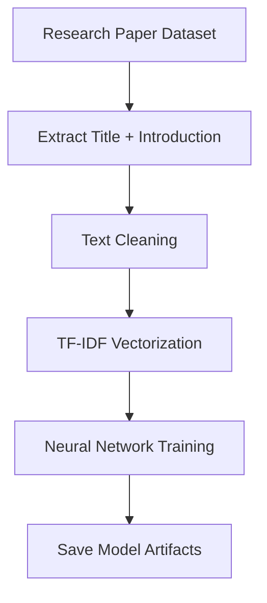

# ConfScope — Conference Acceptance Prediction System

---

## Overview

ConfScope leverages natural language processing and deep learning to predict the likelihood of a research paper being accepted to top NLP conferences (ACL, CoNLL, ICLR) based on its title and introduction. The system uses a TF-IDF feature extraction pipeline combined with a TensorFlow neural network to deliver real-time classification with **85.9% accuracy**.

### How It Works

The system analyzes the **title** and **introduction** of research papers to predict which conference (if any) would most likely accept the paper, providing confidence scores for each category.

---

##  Features

-  **PDF Upload** — Upload research paper PDFs for instant analysis
-  **Automatic Text Extraction** — Extracts title and introduction automatically
-  **Real-time Predictions** — Get acceptance probabilities in <300ms
-  **4-Class Classification** — Predicts across four categories:
  - `000` → **Rejected**
  - `001` → **ICLR**
  - `010` → **CoNLL**
  - `100` → **ACL**
-  **Probability Visualization** — Clear display of confidence scores
-  **Fast Inference** — Deployed backend API for instant results

---

##  Performance Metrics

| Metric | Value |
|--------|-------|
| **Dataset Size** | 1,311 research paper samples |
| **Test Accuracy** | **85.9%** |
| **Number of Classes** | 4 |
| **Feature Dimensionality** | 7,500 TF-IDF features |
| **Inference Latency** | <300ms per prediction |
| **Model Type** | Dense Neural Network |
| **Deployment** | Flask (Render) + React (Vercel) |

---

## 🔄 NLP Pipeline

### Training Pipeline



**Steps:**

1. **Load dataset** of 1,311 research papers
2. **Combine** title and introduction text
3. **Clean text:**
   - Lowercasing
   - Remove punctuation and digits
   - Normalize whitespace
4. **Vectorize** using TF-IDF (7,500 features)
5. **Train** neural network with class balancing and early stopping
6. **Save** model, vectorizer, and label encoder

---

### Inference Pipeline

```
User uploads PDF
        ↓
Flask Backend
        ↓
PDF Text Extraction (PyPDF2)
        ↓
Text Cleaning
        ↓
TF-IDF Vectorization (7,500 features)
        ↓
TensorFlow Model Prediction
        ↓
Probability Output (4 classes)
        ↓
Frontend Visualization
```

---

## 🏗️ System Architecture

```
┌─────────────────────┐
│   React Frontend    │
│  (Vercel Deploy)    │
└──────────┬──────────┘
           │
           ▼
┌─────────────────────┐
│   Flask REST API    │
│  (Render Deploy)    │
└──────────┬──────────┘
           │
           ▼
┌─────────────────────┐
│ PDF Text Extraction │
│      (PyPDF2)       │
└──────────┬──────────┘
           │
           ▼
┌─────────────────────┐
│  TF-IDF Feature     │
│   Vectorization     │
│  (7,500 features)   │
└──────────┬──────────┘
           │
           ▼
┌─────────────────────┐
│  TensorFlow Neural  │
│      Network        │
│   (256→128→4)       │
└──────────┬──────────┘
           │
           ▼
┌─────────────────────┐
│  Prediction +       │
│  Confidence Scores  │
└──────────┬──────────┘
           │
           ▼
┌─────────────────────┐
│  Frontend Display   │
└─────────────────────┘
```

---

##  Tech Stack

### Machine Learning
- **TensorFlow / Keras** — Deep learning framework
- **scikit-learn** — TF-IDF vectorization and preprocessing
- **NumPy** — Numerical computations
- **Pandas** — Data manipulation

### Backend
- **Python** 3.8+
- **Flask** — REST API framework
- **PyPDF2** — PDF text extraction

### Frontend
- **React** 18+ — UI framework
- **TailwindCSS** — Styling
- **Vite** — Build tool

### Deployment
- **Backend:** Render (Flask API)
- **Frontend:** Vercel (React App)

---

## 📁 Project Structure

```
conf-scope/
│
├── frontend/
│   ├── src/
│   │   ├── components/
│   │   ├── App.jsx
│   │   └── main.jsx
│   ├── public/
│   ├── package.json
│   └── vite.config.js
│
├── backend/
│   ├── app.py                    # Flask API server
│   ├── train_model.py            # Model training script
│   ├── tfidf_vectorizer.pkl      # Trained TF-IDF vectorizer
│   ├── label_encoder.pkl         # Label encoder
│   ├── conf_scope_model.h5       # Trained neural network
│   └── requirements.txt
│
└── README.md
```

---

##  Installation

### Prerequisites

- Python 3.8+
- Node.js 16+
- npm or yarn

---

### 1. Clone Repository

```bash
git clone https://github.com/sshivamanand/conf-scope.git
cd conf-scope
```

---

### 2. Backend Setup

```bash
cd backend

# Create virtual environment
python -m venv venv

# Activate virtual environment
# On Linux/Mac:
source venv/bin/activate
# On Windows:
venv\Scripts\activate

# Install dependencies
pip install -r requirements.txt

# Start Flask server
python app.py
```

**Backend runs at:** `http://localhost:5000`

---

### 3. Frontend Setup

```bash
cd frontend

# Install dependencies
npm install

# Start development server
npm run dev
```

**Frontend runs at:** `http://localhost:5173`

---

##  API Endpoint

### `POST /predict`

Predicts conference acceptance probability for a research paper PDF.

**Request:**

```http
POST /predict HTTP/1.1
Content-Type: multipart/form-data

file: <research_paper.pdf>
```

**Response:**

```json
{
  "000": 0.099,
  "001": 0.083,
  "010": 0.064,
  "100": 0.754
}
```

**Interpretation:**
- `000`: 9.9% — Rejected
- `001`: 8.3% — ICLR
- `010`: 6.4% — CoNLL
- `100`: 75.4% — **ACL** (Highest probability → Predicted conference)

---

### Example with cURL

```bash
curl -X POST -F "file=@paper.pdf" https://conf-scope.onrender.com/predict
```

**Response Time:** ~249ms

---

## 📈 Performance Benchmark

### Inference Latency Test

```bash
time curl -X POST -F "file=@paper.pdf" http://127.0.0.1:5000/predict
```

**Result:**
```
real    0m0.249s
```

 **Average latency:** <300ms per prediction (CPU)

---

## Example Usage

### Python API Call

```python
import requests

# Upload PDF and get prediction
with open('research_paper.pdf', 'rb') as f:
    response = requests.post(
        'https://conf-scope.onrender.com/predict',
        files={'file': f}
    )

predictions = response.json()
print(predictions)
```

**Output:**

```json
{
  "000": 0.12,
  "001": 0.68,
  "010": 0.05,
  "100": 0.15
}
```

**Interpretation:** 68% probability of acceptance to **ICLR**

---

### Programmatic Prediction

```python
from predict import predict_conference

result = predict_conference(
    title="Neural Morphological Inflection",
    introduction="We propose a neural sequence model for morphological inflection..."
)

print(result)
```

**Output:**

```python
{
    '000': 0.12,  # Rejected
    '001': 0.68,  # ICLR ✓ (Predicted)
    '010': 0.05,  # CoNLL
    '100': 0.15   # ACL
}
```
---

##  Dataset

The model was trained on **1,311 research paper samples** from top NLP conferences:

- **ACL** (Association for Computational Linguistics)
- **CoNLL** (Conference on Natural Language Learning)
- **ICLR** (International Conference on Learning Representations)

Papers labeled as rejected were used as the negative class.

---

## Model Training

To retrain the model with your own dataset:

```bash
cd backend
python train_model.py
```

This will:
1. Load and preprocess the dataset
2. Extract TF-IDF features
3. Train the neural network
4. Save model artifacts (`conf_scope_model.h5`, `tfidf_vectorizer.pkl`, `label_encoder.pkl`)

---

## 🤝 Contributing

Contributions are welcome! Please feel free to submit a Pull Request.

1. Fork the repository
2. Create your feature branch (`git checkout -b feature/AmazingFeature`)
3. Commit your changes (`git commit -m 'Add some AmazingFeature'`)
4. Push to the branch (`git push origin feature/AmazingFeature`)
5. Open a Pull Request

---

## License

This project is licensed under the MIT License.

---
